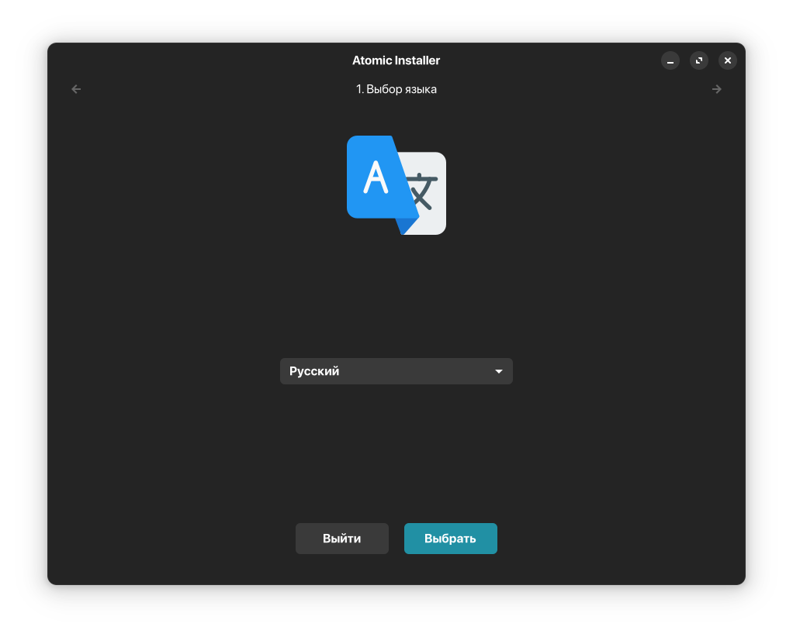

# Atomic installer
Универсальный установщик для любых атомарных образов на базе ALT Atomic.



# Установка

```
git clone https://github.com/alt-atomic/atomic-installer.git
go build (первый запуск займет много времени)
sudo -E ./installer (где installer название бинарного файла, а -E нужен для корректной работы GUI под системным пользователем)
```

Для корректной работы установщик будет искать конфигурационный файл по пути /etc/installer/config.yml либо в рабочей директории.
Переводы находятся внутри проекта в директории data/locales